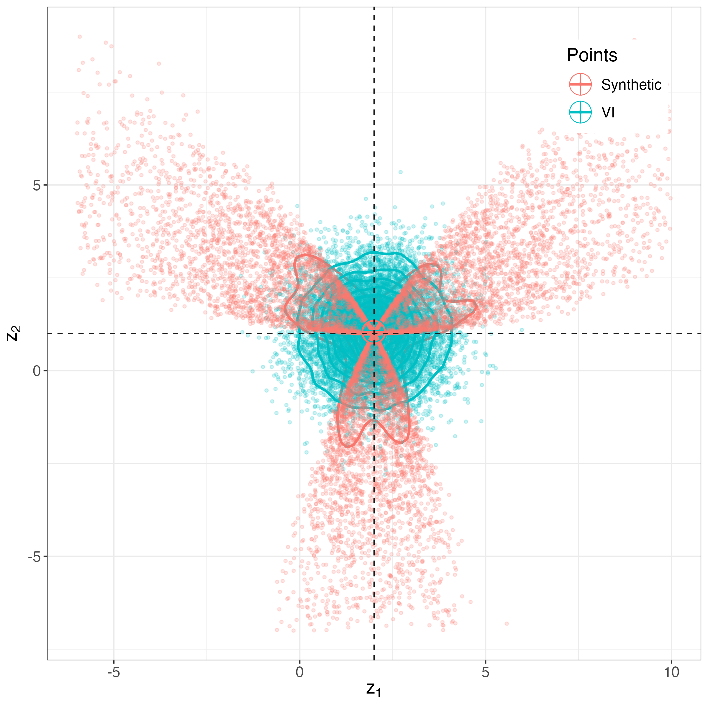

## Qualifying Paper #1
# Variational Inference in Location-Scale Families: Exact Recovery of the Mean and Correlation Matrix
An analysis of the work done by Charles C. Margossian and  Lawrence K. Saul.

We relax the sufficient conditions to recover the mean exactly. 
Margossian and Saul proved that if the target exhibits even symmetry, then VI can exactly recover the mean.
Here, we show that VI recovers the mean of the target density $p$ if it exhibits a rotational symmetry.
That is, if $p(\mu + z) = p(\mu + Rz)$ for some rotation matrix $R$ and $Q$ is a spherically symmetric location family, then there exists a unique minimizer of the KL divergence from $q$ to $p$ when the points of symmetry coincide.

VI recovers the mean of a target with $\frac{2 \pi}{3}$-rotational symmetry:

  

